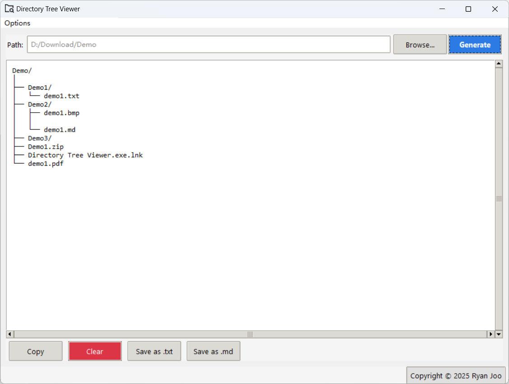
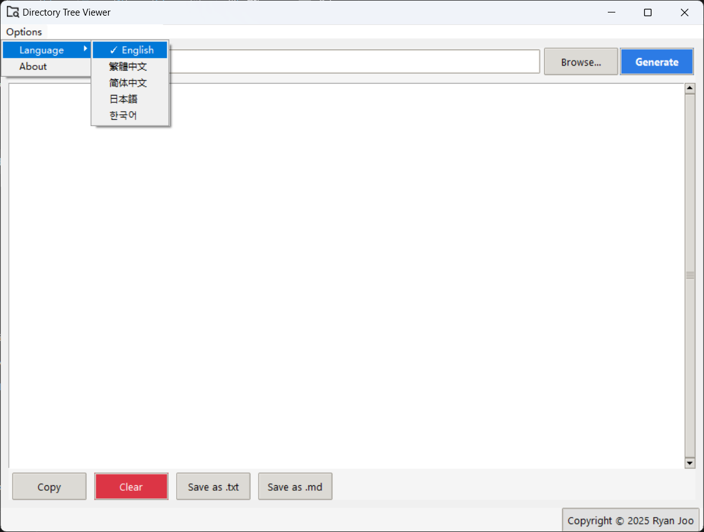
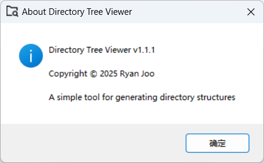

# 📂 Directory Tree Viewer


**Multilingual Directory Structure Visualization Tool** | English | [中文](./README_ZH.md)

---

## ✨ Features
- Supports Chinese/English/Japanese/Korean/Traditional Chinese
- Graphical interface (Tkinter)
- Export directory tree as text/Markdown format
- Automatically detects system language and adapts sorting rules







---

## 🚀 Quick Start
### Basic Installation
```bash
# Clone the project
git clone https://github.com/yourname/dir-tree-viewer.git

# Install dependencies
pip install -r requirements.txt

# Launch GUI
python show_tree_gui.py
```

### Executable File

Windows users can directly download the `.exe` file from the [Releases page](https://github.com/RyanJoo28/directory-tree-viewer/releases)

## 🛠️ Development Build

### Dependency Management

```bash
# Generate new requirements.txt
pip freeze > requirements.txt

# Build executable
pyinstaller --onefile --icon=assets/icon.ico show_tree_gui.py
```

## 📜 License

This project is licensed under [MIT License](LICENSE)

